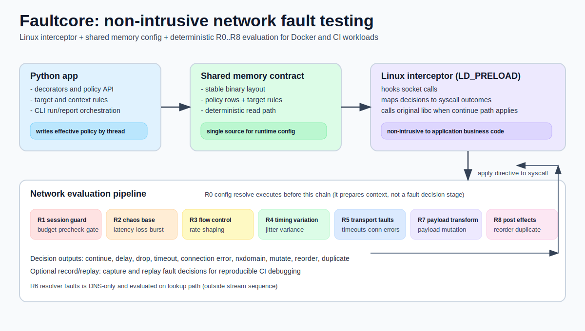

<p align="center">
  
</p>

<p align="center">
  <a href="https://www.python.org/downloads/"></a>
  <a href="https://opensource.org/licenses/MIT"></a>
  <a href="https://pypi.org/project/faultcore/"></a>
  <a href="https://pypi.org/project/faultcore/"></a>
  <a href="https://github.com/albertobadia/faultcore/actions/workflows/ci.yml"></a>
  <a href="https://faultcore.readthedocs.io/en/latest/"></a>
</p>

Helps you test how your application behaves under realistic network failures without rewriting application code or introducing an in-app proxy layer.

Core value:
- non-intrusive Linux socket interception through `LD_PRELOAD`;
- Python-first ergonomics (decorators, policy APIs, CLI workflows);
- deterministic and reproducible fault decisions for CI validation;
- broad fault model coverage across connection, transport, DNS, and payload behavior.

Detailed documentation lives in `docs/` and is published at:
- https://faultcore.readthedocs.io/en/latest/

Package distribution (PyPI):
- https://pypi.org/project/faultcore/

## High-level architecture



Execution model:
1. Python decorators/policies write effective configuration to shared memory.
2. Linux interceptor hooks socket syscalls (`send`, `recv`, `connect`, `sendto`, `recvfrom`, `getaddrinfo`).
3. `faultcore_network` evaluates a deterministic runtime-stage graph (`R0..R8`) with operation-specific applicability.
4. Runtime applies directives (delay, drop, timeout, error, mutate, reorder, duplicate) and then calls original libc functions when needed.

## Quick Start

Install from PyPI:

```bash
pip install faultcore
```

Requirements:
- Python 3.10+
- Rust toolchain
- Linux for network interception

Install development dependencies and build native artifacts:

```bash
uv sync --group dev
./build.sh
```

`build.sh` expects `.venv/bin/python` to exist, validates version alignment across
`pyproject.toml`, `faultcore_interceptor/Cargo.toml`, and `faultcore_network/Cargo.toml`,
then stages Linux interceptor artifacts into `src/faultcore/_native/<platform-tag>/` before building wheels.

Fast validation path:

```bash
sh lint.sh
sh build.sh
sh tests.sh
```

Long stress path (optional):

```bash
sh tests_long.sh
```

CLI-first execution:

```bash
uv run faultcore doctor
uv run faultcore run -- python -c "import socket; print('ok')"
uv run faultcore run --run-json artifacts/run.json -- pytest -q
uv run faultcore report --input artifacts/run.json --output artifacts/report.html
uv run faultcore report --input artifacts/run.json --output artifacts/report.latest.html --max-events 200 --reverse-events
```

Notes:
- `faultcore run` defaults to strict mode on Linux and exits with code `2` when interceptor probing fails.
- Use `--no-strict` only for debugging environments where preload activation is intentionally unavailable.
- With `--run-json`, CLI enables record/replay capture mode automatically when mode is unset/off and writes `<run-json>.rr.jsonl.gz` when `FAULTCORE_RECORD_REPLAY_PATH` is unset.
- `faultcore report` supports optional event rendering controls: `--max-events` and `--reverse-events`.

Manual `LD_PRELOAD` execution is still available for advanced debugging.

Platform behavior:
- Linux: `faultcore run` configures `LD_PRELOAD` automatically and probes interceptor activation in strict mode.
- Non-Linux: decorators and policy APIs are still callable, but interceptor-level network effects are not active.

Minimal usage:

```python
import faultcore

@faultcore.timeout(connect="200ms")
def slow_operation():
    return "ok"

@faultcore.rate("10mbps")
def network_operation():
    return "ok"
```

## What you can test

It supports failure scenarios that commonly cause production-only bugs:

- latency and jitter;
- packet loss and burst loss;
- bandwidth throttling;
- connection and receive timeouts;
- connection error injection;
- DNS delay, timeout, and NXDOMAIN;
- correlated loss (Gilbert-Elliott style state behavior);
- directional profiles (uplink vs downlink);
- packet duplicate and packet reorder;
- session budget limits (bytes, ops, duration);
- payload mutation in stream operations;
- target-aware rules (hostname/SNI/protocol/address/port based scope);
- record/replay for reproducible failure timelines.

These can be combined in one run to validate retries, idempotency, fallbacks, parser robustness, and resilience logic under stress.

## Typical CI use cases

- Validate retry/backoff behavior under timeout + packet loss.
- Validate DNS fallback and graceful degradation under resolver faults.
- Validate stream parser robustness under payload mutation and reorder.
- Reproduce flaky integration failures with record/replay evidence.
- Generate run JSON + HTML report artifacts for post-run analysis.

## Documentation Index

Primary docs entrypoint:
- [`docs/index.md`](docs/index.md)
- Read the Docs: https://faultcore.readthedocs.io/en/latest/

Core documentation paths:

| Document | Scope |
|---|---|
| [`docs/getting_started.md`](docs/getting_started.md) | Installation, first run, first decorator |
| [`docs/cli_usage.md`](docs/cli_usage.md) | CLI commands (`doctor`, `run`, `report`) and recommended workflows |
| [`docs/api_reference.md`](docs/api_reference.md) | Feature-by-feature reference (timeout, rate, latency, jitter, loss, DNS, policy APIs) |
| [`docs/examples.md`](docs/examples.md) | Scenario map and recommended testing patterns |
| [`docs/troubleshooting.md`](docs/troubleshooting.md) | Symptom-based troubleshooting and quality gate |

Deep-dive references:

| Document | Scope |
|---|---|
| [`docs/architecture.md`](docs/architecture.md) | System architecture with runtime-stage graph and module layout |
| [`docs/policies_and_context.md`](docs/policies_and_context.md) | Policy lifecycle and application patterns |
| [`docs/interceptor_and_shm.md`](docs/interceptor_and_shm.md) | CLI runtime and SHM/interceptor details |
| [`docs/testing_and_examples.md`](docs/testing_and_examples.md) | Build/test command details and legacy examples |
| [`docs/shm_protocol.md`](docs/shm_protocol.md) | SHM binary layout and consistency protocol |
| [`docs/operations_tuning.md`](docs/operations_tuning.md) | Baseline/tuning/stress operational guidance |

## Build Documentation (Sphinx + MyST)

Generate HTML docs locally:

```bash
uv run sphinx-build -M html docs docs/_build
```

Open generated site entrypoint:
- `docs/_build/html/index.html`

## Publish to PyPI

The project includes a release workflow at `.github/workflows/publish-pypi.yml` that builds:
- Linux `x86_64` wheels
- Linux `i686` wheels
- Linux `aarch64` wheels
- one source distribution (`sdist`)

Release options:

1. Push a tag like `v2026.3.8` to publish directly to PyPI.
2. Run the workflow manually (`workflow_dispatch`) and choose:
   - `pypi` for production publish
   - `testpypi` for dry-run validation

The wheel build uses `cibuildwheel` and stages architecture-specific native artifacts with
`scripts/build_native_artifacts.sh` before each wheel build.

## Project Status

- Python package metadata: `pyproject.toml`
- Public API source of truth: `src/faultcore/__init__.py`
- Decorator behavior source of truth: `src/faultcore/decorator.py`
- Unit tests: `tests/unit/`
- Integration CLI scripts: `tests/integration/`

## License

MIT
