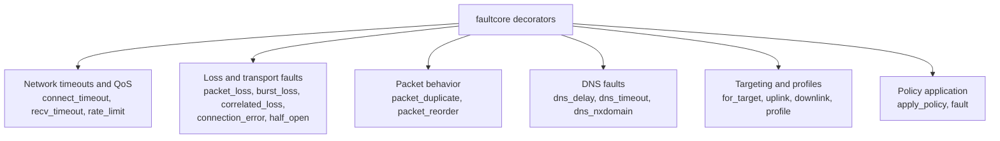

# API Reference

This document describes the public Python API exported by `faultcore`.

Source of truth:
- `src/faultcore/__init__.py`
- `src/faultcore/decorator.py`
- `src/faultcore/policy_registry.py`

## Decorators

### Decorator Families Map



### `connect_timeout(timeout_ms: int)`

Set socket connect timeout in shared policy state.

- `timeout_ms` must be `>= 0`.
- Writes `(connect_ms, recv_ms) = (timeout_ms, 0)`.

### `recv_timeout(timeout_ms: int)`

Set socket receive timeout in shared policy state.

- `timeout_ms` must be `>= 0`.
- Writes `(connect_ms, recv_ms) = (0, timeout_ms)`.

### `latency(latency_ms: int)`

Set fixed latency in milliseconds.

### `jitter(jitter_ms: int)`

Set jitter in milliseconds.

### `packet_loss(loss: str | int | float)`

Set packet loss as parts-per-million (PPM) internally.

### `burst_loss(length: int)`

Set burst packet loss length.

### `uplink(...)` and `downlink(...)`

Apply directional network profiles.

Accepted keyword fields:
- `latency_ms`
- `jitter_ms`
- `packet_loss`
- `burst_loss_len`
- `rate`

### `correlated_loss(...)`

Apply correlated packet loss using a two-state model (`GOOD`/`BAD`).

### `connection_error(...)`

Inject explicit socket errors.

### `half_open(...)`

Force stream failure after a byte threshold.

### `packet_duplicate(...)`

Inject duplicated sends.

### `packet_reorder(...)`

Inject packet reordering on stream paths.

### `dns_delay(delay_ms: int)`

Inject DNS lookup delay (for `getaddrinfo`).

### `dns_timeout(timeout_ms: int)`

Inject DNS lookup timeout behavior (`EAI_AGAIN`) after waiting.

### `dns_nxdomain(prob: str | int | float = "100%")`

Inject NXDOMAIN-style DNS failures (`EAI_NONAME`) with probability.

### `rate_limit(rate: str | int)`

Set bandwidth in bits per second (bps) internally.

### `for_target(...)`

Apply faults only when destination matches a target filter (IP/CIDR/hostname/SNI + port/protocol).

### `profile(...)`

Apply a temporal profile (`ramp`, `spike`, `flapping`) and optional fault values.

### `apply_policy(policy_name: str)`

Apply a named registered policy to a function.

### `fault(policy_name: str = "auto")`

Apply policy by name, or from thread-local context when `"auto"`.

## Policy Registry API

### `register_policy(...)`

Register or replace a named policy.

```python
register_policy(
    name: str,
    *,
    latency_ms: int | None = None,
    jitter_ms: int | None = None,
    packet_loss: str | int | float | None = None,
    burst_loss_len: int | None = None,
    rate: str | int | float | None = None,
    connect_timeout_ms: int | None = None,
    recv_timeout_ms: int | None = None,
    uplink: dict[str, Any] | None = None,
    downlink: dict[str, Any] | None = None,
    correlated_loss: dict[str, Any] | None = None,
    connection_error: dict[str, Any] | None = None,
    half_open: dict[str, Any] | None = None,
    packet_duplicate: dict[str, Any] | None = None,
    packet_reorder: dict[str, Any] | None = None,
    dns_delay_ms: int | None = None,
    dns_timeout_ms: int | None = None,
    dns_nxdomain: str | int | float | None = None,
    target: str | dict[str, Any] | None = None,
    targets: list[str | dict[str, Any]] | None = None,
    schedule: dict[str, Any] | None = None,
    session_budget: dict[str, Any] | None = None,
) -> None
```

Notes:
- `timeout_ms` is not supported.
- Use `connect_timeout_ms` and `recv_timeout_ms` explicitly.

### Other registry functions

- `list_policies() -> list[str]`
- `get_policy(name: str) -> dict[str, Any] | None`
- `unregister_policy(name: str) -> bool`
- `load_policies(path: str | Path) -> int`

## Context API

- `fault_context(policy_name: str | None = None)`
- `set_thread_policy(policy_name: str | None)`

`fault_context` temporarily overrides thread policy name and restores the previous value on exit.
