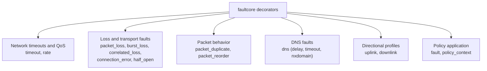

# API Reference

This document describes the public Python API exported by `faultcore`.

Source of truth:
- `src/faultcore/__init__.py`
- `src/faultcore/decorator.py`
- `src/faultcore/policy_registry.py`

## Decorators

### Decorator Families Map



### `timeout(*, connect: str | None = None, recv: str | None = None)`

Set socket connect and/or receive timeout.

- Both parameters accept duration strings (e.g., `"200ms"`, `"1s"`, `"500us"`).
- Setting `connect` configures connection timeout.
- Setting `recv` configures receive timeout.

### `latency(t: str)`

Set fixed latency. Parameter accepts duration string (e.g., `"50ms"`, `"1s"`).

### `jitter(t: str)`

Set jitter. Parameter accepts duration string (e.g., `"10ms"`, `"500us"`).

### `packet_loss(p: str, /)`

Set packet loss as parts-per-million (PPM). String values support suffixes: `%` (percentage) or `ppm` (e.g., `"1%"`, `"0.1%"`, `"1000ppm"`).

### `burst_loss(n: str, /)`

Set burst packet loss length (consecutive packets to drop). Parameter accepts a string (e.g., `"3"`, `"5"`).

### `uplink(...)` and `downlink(...)`

Apply directional network profiles.

Accepted keyword fields:
- `latency` (duration string like `"50ms"`)
- `jitter` (duration string like `"10ms"`)
- `packet_loss` (percentage or ppm, e.g., `"1%"`)
- `burst_loss` (string like `"3"`)
- `rate` (bandwidth string like `"10mbps"`)

### `correlated_loss(*, p_good_to_bad: str, p_bad_to_good: str, loss_good: str, loss_bad: str)`

Apply correlated packet loss using a two-state model (`GOOD`/`BAD`).

- `p_good_to_bad`: probability of transitioning from GOOD to BAD state
- `p_bad_to_good`: probability of transitioning from BAD to GOOD state
- `loss_good`: packet loss rate when in GOOD state (PPM or percentage)
- `loss_bad`: packet loss rate when in BAD state (PPM or percentage)

### `connection_error(*, kind: str, prob: str = "100%")`

Inject explicit socket errors.

- `kind`: error type (`reset`, `refused`, or `unreachable`)
- `prob`: probability of error injection (default 100%)

### `half_open(*, after: str, error: str = "reset")`

Force stream failure after a byte threshold.

- `after`: byte threshold after which to inject failure (e.g., `"1kb"`, `"1mb"`)
- `error`: error type to inject (`reset`, `refused`, or `unreachable`)

### `packet_duplicate(*, prob: str = "100%", max_extra: int = 1)`

Inject duplicated sends.

- `prob`: probability of duplication (e.g., `"100%"`, `"10%"`)
- `max_extra`: maximum number of extra copies to send (default 1)

### `packet_reorder(*, prob: str = "100%", max_delay: str = "0ms", window: int = 1)`

Inject packet reordering on stream paths.

- `prob`: probability of reordering (e.g., `"100%"`, `"5%"`)
- `max_delay`: maximum delay for reordered packets (duration string like `"50ms"`)
- `window`: number of packets to hold before releasing reordered ones

### `dns(*, delay: str | None = None, timeout: str | None = None, nxdomain: str | None = None)`

Inject DNS lookup faults. Parameters accept duration strings (e.g., `"50ms"`, `"1s"`) or probability values (e.g., `"100%"`).

- `delay`: inject lookup delay.
- `timeout`: inject timeout behavior (`EAI_AGAIN`) after waiting.
- `nxdomain`: inject NXDOMAIN-style DNS failures (`EAI_NONAME`) with probability.

### `rate(r: str)`

Set bandwidth. String parameter requires a suffix: `bps`, `kbps`, `mbps`, or `gbps` (e.g., `"10mbps"`, `"1gbps"`, `"500kbps"`, `"1000bps"`).

### `session_budget(*, max_tx: str | None = None, max_rx: str | None = None, max_ops: int | None = None, max_duration: str | None = None, action: str = "drop", budget_timeout: str | None = None, error: str | None = None)`

Set session-level budget limits that trigger terminal actions.

- `max_tx`: maximum bytes to transmit before triggering action (e.g., `"1kb"`, `"1mb"`)
- `max_rx`: maximum bytes to receive before triggering action (e.g., `"1kb"`, `"1mb"`)
- `max_ops`: maximum operations before triggering action
- `max_duration`: maximum session duration before triggering action (e.g., `"30s"`)
- `action`: terminal action (`drop`, `timeout`, or `connection_error`)
- `budget_timeout`: required for `action=timeout` - timeout duration (e.g., `"5s"`)
- `error`: optional for `action=connection_error` - error kind (`reset`, `refused`, `unreachable`)

### `fault(policy_name: str = "auto")`

Apply policy by name, or from thread-local context when `"auto"`.

Note: Target filtering is available via the `targets` parameter in `register_policy()`, not as a separate decorator. The `schedule` parameter supports temporal profiles (`ramp`, `spike`, `flapping`).

### `register_policy(...)`

Register or replace a named policy.

```python
register_policy(
    name: str,
    *,
    seed: str | int | None = None,
    latency: str | None = None,
    jitter: str | None = None,
    packet_loss: str | None = None,
    burst_loss: str | None = None,
    rate: str | None = None,
    timeout: dict[str, Any] | None = None,
    uplink: dict[str, Any] | None = None,
    downlink: dict[str, Any] | None = None,
    correlated_loss: dict[str, Any] | None = None,
    connection_error: dict[str, Any] | None = None,
    half_open: dict[str, Any] | None = None,
    packet_duplicate: dict[str, Any] | None = None,
    packet_reorder: dict[str, Any] | None = None,
    dns: dict[str, Any] | None = None,
    targets: list[str | dict[str, Any]] | None = None,
    schedule: dict[str, Any] | None = None,
    session_budget: dict[str, Any] | None = None,
) -> None
```

Notes:
- `timeout` accepts a dict with `connect` and/or `recv` keys (e.g., `{"connect": "200ms", "recv": "500ms"}`).
- `latency` and `jitter` accept duration strings (e.g., `"50ms"`, `"1s"`).
- `rate` accepts bandwidth string (e.g., `"10mbps"`, `"1gbps"`).
- `seed` provides deterministic random behavior when set.
- `session_budget` supports `max_tx`, `max_rx` (size strings like "1kb"), `max_ops`, `max_duration` with required `action` (`drop`/`timeout`/`connection_error`). For `action=timeout`, also specify `budget_timeout`. For `action=connection_error`, optionally specify `error` (`reset`/`refused`/`unreachable`).

### `targets: list[str | dict[str, Any]] | None`

Apply fault policies to specific network targets only.

Each target entry can be a string or dict:

**String format:**
- `"tcp://10.0.0.0/8:9000"` - CIDR with port
- `"tcp://127.0.0.1:9000"` - host IP with port
- `"udp://hostname:9001"` - UDP with hostname
- `"http://example.com:443"` - HTTP/HTTPS with hostname

**Dict format:**
```python
{
    "target": "tcp://127.0.0.1:9000",  # optional, alternative to host/cidr
    "host": "10.0.0.1",                # optional, IPv4/IPv6 address
    "cidr": "10.0.0.0/8",             # optional, CIDR range
    "hostname": "example.com",       # optional, DNS hostname
    "sni": "example.com",            # optional, TLS SNI
    "port": 9000,                      # optional, port number
    "protocol": "tcp",               # optional: "tcp", "udp", or omit for any
    "priority": 100,                   # optional: higher priority wins
}
```

Selection semantics:
- First matching rule by highest priority wins
- Ties resolved by registration order

### `schedule: dict[str, Any] | None`

Apply temporal scheduling profiles to faults.

**Schedule kinds:**

- `"ramp"` - gradually increase fault intensity
  - `ramp`: duration to ramp up (e.g., `"10s"`)

- `"spike"` - periodic fault spikes
  - `every`: cycle duration (e.g., `"30s"`)
  - `duration`: active spike duration (e.g., `"5s"`)

- `"flapping"` - alternating on/off states
  - `on`: active duration (e.g., `"10s"`)
  - `off`: inactive duration (e.g., `"20s"`)

```python
# Spike schedule example
schedule={"kind": "spike", "every": "30s", "duration": "5s"}

# Flapping schedule example  
schedule={"kind": "flapping", "on": "10s", "off": "20s"}

# Ramp schedule example
schedule={"kind": "ramp", "ramp": "60s"}
```

### Other registry functions

- `list_policies() -> list[str]`
- `get_policy(name: str) -> dict[str, Any] | None`
- `unregister_policy(name: str) -> bool`
- `load_policies(path: str | Path) -> int`

## Context API

### `policy_context(policy_name: str | None = None, **policy_kwargs)`

Context manager for thread-local policy application. Supports both named policies and inline policy definition. See [`docs/policies_and_context.md`](policies_and_context.md) for detailed usage.

```python
# Using named policy
with faultcore.policy_context("my_policy"):
    # policy applied here
    pass

# Using inline kwargs
with faultcore.policy_context(latency="50ms", packet_loss="1%"):
    # inline policy applied here
    pass
```

### `set_thread_policy(policy_name: str | None)`

Set thread-local policy name directly.

### `get_thread_policy() -> str | None`

Get current thread-local policy name.
