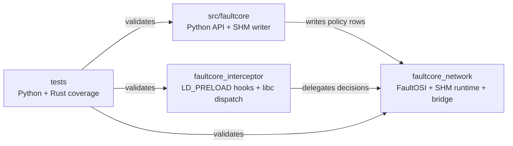
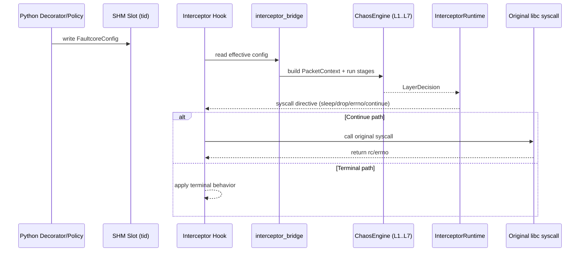
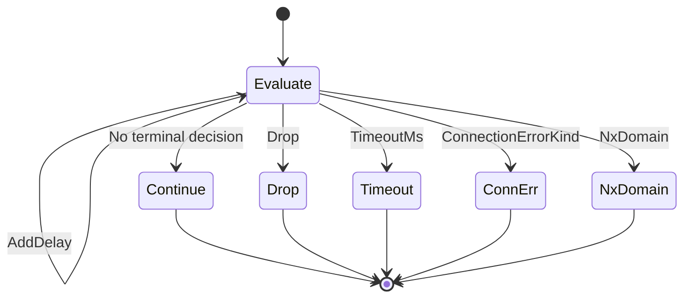

# Architecture

This document describes the current `faultcore` architecture after the FaultOSI cleanup.

## Design Goals

- Keep network fault logic in `faultcore_network`.
- Keep `faultcore_interceptor` as a thin Linux syscall adapter (`LD_PRELOAD` boundary).
- Keep Python API ergonomic while preserving a stable SHM contract.
- Keep layer execution deterministic and testable.

## High-Level Layout

- `src/faultcore/`: Python API, decorators, policy registry, SHM writer.
- `faultcore_network/`: FaultOSI engine, SHM contract/runtime, socket metadata helpers, interceptor bridge.
- `faultcore_interceptor/`: syscall hooks and original libc dispatch (`dlsym`/`RTLD_NEXT`).
- `tests/`: Python unit/integration + Rust unit tests.

### Module Layout Diagram

Diagram focus: ownership boundaries and primary call/data edges.

## Runtime Flow

1. Python decorator/policy writes a `FaultcoreConfig` row into SHM (`tid` slot).
2. Interceptor hook is called (`send`, `recv`, `connect`, `sendto`, `recvfrom`, `getaddrinfo`).
3. Interceptor asks `faultcore_network::interceptor_bridge` for effective runtime config.
4. `ChaosEngine` runs FaultOSI stages in strict order (`L1..L7`).
5. `InterceptorRuntime` maps `LayerDecision` to syscall directives (`sleep`, return value, `errno`).
6. Interceptor applies directive and delegates to original libc function if needed.

### Runtime Sequence Diagram

Diagram focus: runtime interaction order from Python write to syscall result.

## Module Responsibilities

### Python package (`src/faultcore`)

- `__init__.py`: public API surface, stable export list.
- `decorator.py`: decorator behavior, policy registration/validation, context wiring.
- `shm_writer.py`: SHM open/write semantics and binary writes for policy fields.

### `faultcore_network/src`

- `lib.rs`: public composition and re-exports.
- `layers/mod.rs`: shared layer contracts (`Layer`, `LayerDecision`, `PacketContext`, `LayerStage`).
- `layers/l1_chaos.rs`: latency, packet loss, burst loss, correlated loss, reorder/duplicate trigger decisions.
- `layers/l2_qos.rs`: bandwidth/token-bucket shaping.
- `layers/l3_routing.rs`: jitter/routing variance.
- `layers/l4_transport.rs`: connect/recv timeouts and transport-level error injection.
- `layers/l5_session.rs`: session-level budget pre-checks (`max_bytes_tx/rx`, `max_ops`, `max_duration_ms`) with terminal actions.
- `layers/l6_presentation.rs`: presentation-level placeholder.
- `layers/l7_resolver.rs`: DNS delay/timeout/NXDOMAIN decisions.
- `chaos_engine.rs`: strict L1..L7 orchestration and stage metrics.
- `runtime.rs`: interceptor runtime state (non-blocking delay tracking, reorder queues) and decision-to-directive mapping.
- `shm_contract.rs`: SHM binary schema/constants/validation (`FaultcoreConfig`, offsets, limits).
- `shm_runtime.rs`: SHM mapping, stable reads, `tid`/`fd` assignment helpers.
- `socket_runtime.rs`: socket metadata extraction (`protocol`, peer/addr endpoint, monotonic clock).
- `interceptor_bridge.rs`: single façade used by interceptor to fetch effective runtime config and bind/clear fd policy.
- `setpriority_compat.rs`: optional compatibility shim for legacy `setpriority` control path.

### `faultcore_interceptor/src`

- `lib.rs`: only hook-facing concerns:
  - resolve and call original libc symbols;
  - recursion guard;
  - hook entrypoints;
  - call into `faultcore_network` for config + decision mapping;
  - apply syscall-level behavior.

## FaultOSI Semantics

- Stage order is fixed: `L1 -> L2 -> L3 -> L4 -> L5 -> L6 -> L7`.
- Main pipeline accepts terminal outcomes (`Drop`, `TimeoutMs`, `ConnectionErrorKind`, `NxDomain`) and short-circuits.
- Delay decisions are accumulated.
- Reorder and duplicate are post-routing stream behaviors, handled outside main pipeline.
- DNS path evaluates resolver layer behavior and skips non-DNS effects by layer applicability.
- Gilbert-Elliott correlated-loss state is tracked per FD in `L1Chaos` to avoid cross-flow coupling.

### Fault Decision State Diagram

Diagram focus: accumulated delay vs terminal short-circuit decisions.

### Reorder Matrix

- `send`: supported (`LayerDecision::StageReorder` + per-FD staging queue)
- `sendto`: supported (`LayerDecision::StageReorder` + per-FD staging queue)
- `recv`: supported (blocking and non-blocking, using dedicated recv pending queue)
- `recvfrom`: supported (blocking and non-blocking, using dedicated recv pending queue)

## Ownership Boundaries

- Business/network fault behavior belongs to `faultcore_network`.
- Linux interception details belong to `faultcore_interceptor`.
- SHM binary contract belongs to `faultcore_network::shm_contract` and must be reflected by Python writer.

### FD/TID Ownership Model

- Socket creation/binding (`socket` hook) binds an `fd` to the current thread slot via `bind_fd_to_current_thread`.
- Runtime config resolution for stream hooks prefers the `fd` owner slot (`get_tid_slot_for_fd`) when present.
- If the owner slot cannot be resolved to a valid config row, resolution falls back to current thread `tid` config.
- This makes cross-thread `fd` handoff deterministic: the bound owner policy stays authoritative unless explicitly cleared/rebound.
- FD aliasing hooks (`dup`, `dup2`, `dup3`, `accept`, `accept4`) clone the owner binding from source/listener FD to the new FD.

## Change Rules

- SHM layout changes must update:
  - `faultcore_network/src/shm_contract.rs`
  - `src/faultcore/shm_writer.py`
  - `tests/unit/test_shm_contract.py`
  - `docs/shm_protocol.md`
- New network fault behavior should be implemented as a layer concern first, then mapped through `LayerDecision`.
- Interceptor should not gain new policy interpretation logic.
