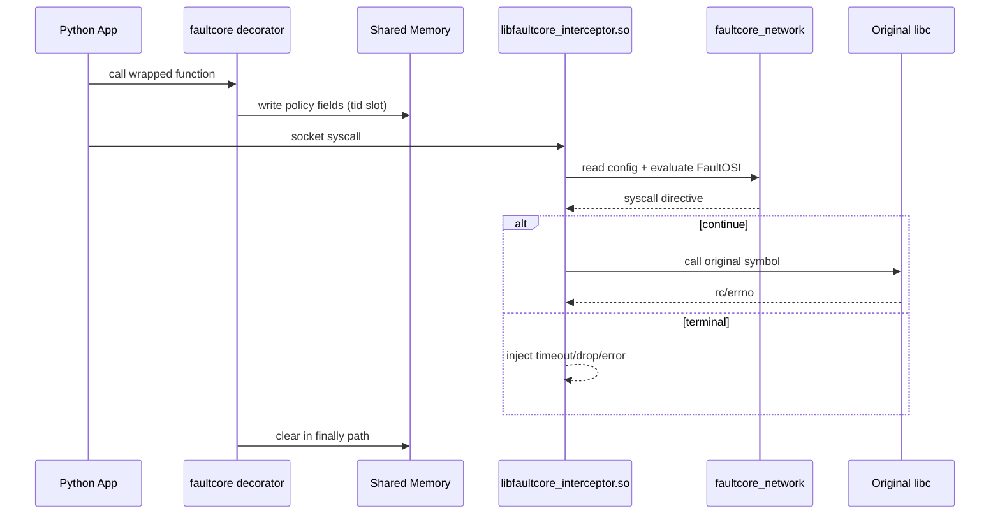
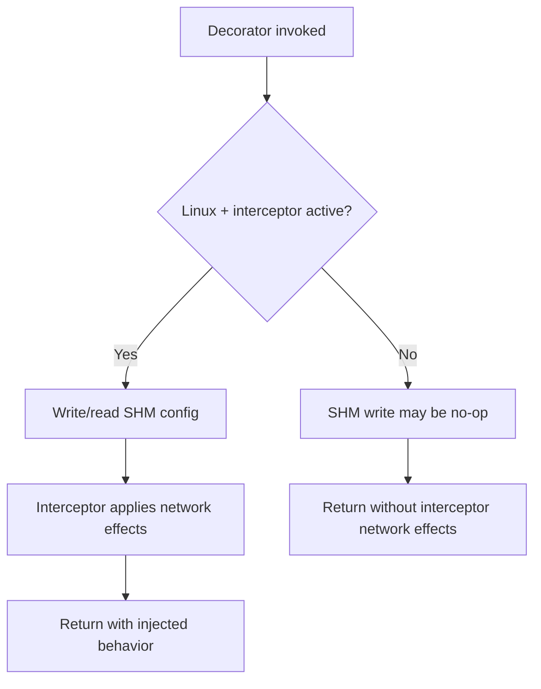

# Interceptor and SHM

This document explains how `faultcore` interacts with the Linux network interceptor and shared memory.

## Runtime Flow

1. Python decorators write policy fields into SHM keyed by native thread id.
2. Interceptor (`libfaultcore_interceptor.so`) intercepts socket syscalls.
3. Interceptor reads SHM config and delegates network effects to `faultcore_network` (FaultOSI pipeline).
4. Wrapped call clears SHM fields in `finally` paths.

### Runtime Sequence Diagram



Diagram focus: end-to-end lifecycle from decorator write to hook behavior.

## CLI-First Linux Usage

Build:

```bash
uv sync
./build.sh
```

Recommended run path:

```bash
faultcore doctor
faultcore run -- python your_script.py
```

Run tests/reports through CLI:

```bash
faultcore run --run-json artifacts/run.json -- pytest -q
faultcore report --input artifacts/run.json --output artifacts/report.html
```

## Advanced Manual `LD_PRELOAD` Usage

For low-level debugging, manual preload is still supported:

```bash
LD_PRELOAD=./src/faultcore/_native/<platform-tag>/libfaultcore_interceptor.so \
python your_script.py
```

Replace `<platform-tag>` with `linux-x86_64` or `linux-aarch64` as appropriate.

## Record/Replay Mode

`faultcore_network` supports deterministic decision capture/replay at runtime.

Environment variables:
- `FAULTCORE_RECORD_REPLAY_MODE`: `off` (default), `record`, or `replay`.
- `FAULTCORE_RECORD_REPLAY_PATH`: gzip JSONL path (default `/tmp/faultcore_record_replay.jsonl.gz`).

Typical workflow:

```bash
# 1) Record a run
FAULTCORE_RECORD_REPLAY_MODE=record \
FAULTCORE_RECORD_REPLAY_PATH=/tmp/faultcore_rr.jsonl.gz \
faultcore run -- python your_script.py

# 2) Replay with the same policy/routing shape
FAULTCORE_RECORD_REPLAY_MODE=replay \
FAULTCORE_RECORD_REPLAY_PATH=/tmp/faultcore_rr.jsonl.gz \
faultcore run -- python your_script.py
```

Notes:
- Replay is fail-fast if event sequence diverges (`site` mismatch or missing events).
- Record ownership lives in `faultcore_network`; interceptor stays a thin syscall adapter.

## Platform Notes

- `LD_PRELOAD` interception is Linux-specific.
- Without active SHM/interceptor, decorators remain callable and fail gracefully (no-op writes).

### Platform Compatibility Flow



Diagram focus: behavior split between active interception and graceful fallback.

## Shared Memory Contract

Binary layout and compatibility rules are documented in:
- `docs/shm_protocol.md`

### SHM Open Modes

- `faultcore_network::try_open_shm()` now supports explicit open ownership via `FAULTCORE_SHM_OPEN_MODE`.
- Supported values:
  - `consumer` (default): open + size validation via `fstat`; no `ftruncate`.
  - `creator`: open + `ftruncate(FAULTCORE_SHM_SIZE)` before `mmap`.
- Initialization is process-once guarded with an internal init lock to avoid double-map races under concurrent open attempts.

Any SHM layout change must update:
- Python writer (`src/faultcore/shm_writer.py`)
- Rust contract/runtime (`faultcore_network/src/shm_contract.rs`, `faultcore_network/src/shm_runtime.rs`)
- contract tests (`tests/unit/test_shm_contract.py`)
- `docs/shm_protocol.md`

## Components

- Python writer: `src/faultcore/shm_writer.py`
- Interceptor: `faultcore_interceptor/`
- Network engine (FaultOSI): `faultcore_network/`
- Architecture reference: `docs/architecture.md`
