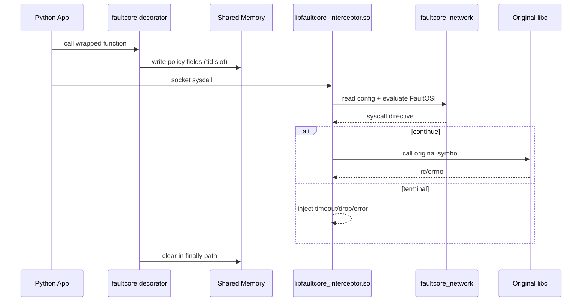
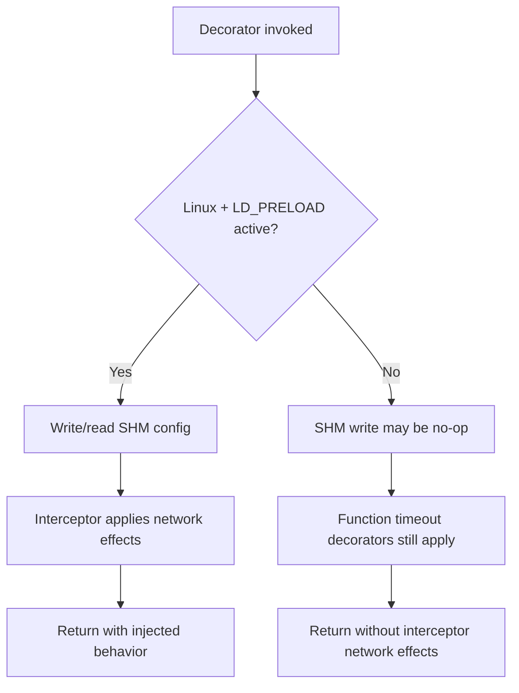

# Interceptor and SHM

This document explains how `faultcore` interacts with the Linux network interceptor and shared memory.

## Runtime Flow

1. Python decorators write policy fields into SHM keyed by native thread id.
2. Interceptor (`libfaultcore_interceptor.so`) intercepts socket syscalls.
3. Interceptor reads SHM config and delegates network effects to `faultcore_network` (FaultOSI pipeline).
4. Wrapped call clears SHM fields in `finally` paths.

### Runtime Sequence Diagram



Diagram focus: end-to-end lifecycle from decorator write to hook behavior.

## Linux `LD_PRELOAD` Usage

Build:

```bash
./build.sh
```

Run:

```bash
LD_PRELOAD=./faultcore_interceptor/target/release/libfaultcore_interceptor.so \
FAULTCORE_WRAPPER_MODE=shm \
python your_script.py
```

Helper script:

```bash
examples/run_with_preload.sh 01_http_requests.py
```

## Interceptor Detection from Python

Utilities:
- `faultcore.is_interceptor_loaded()`
- `faultcore.get_interceptor_path()`

These are convenience checks and not hard guarantees of all runtime conditions.

## Platform Notes

- `LD_PRELOAD` interception is Linux-specific.
- Without active SHM/interceptor, decorators remain callable and fail gracefully (no-op writes).
- Function-level timeout behavior still applies without interceptor.

### Platform Compatibility Flow



Diagram focus: behavior split between active interception and graceful fallback.

## Shared Memory Contract

Binary layout and compatibility rules are documented in:
- `docs/shm_protocol.md`

Any SHM layout change must update:
- Python writer (`src/faultcore/shm_writer.py`)
- Rust contract/runtime (`faultcore_network/src/shm_contract.rs`, `faultcore_network/src/shm_runtime.rs`)
- contract tests (`tests/unit/test_shm_contract.py`)
- `docs/shm_protocol.md`

## Components

- Python writer: `src/faultcore/shm_writer.py`
- Interceptor: `faultcore_interceptor/`
- Network engine (FaultOSI): `faultcore_network/`
- Architecture reference: `docs/architecture.md`
