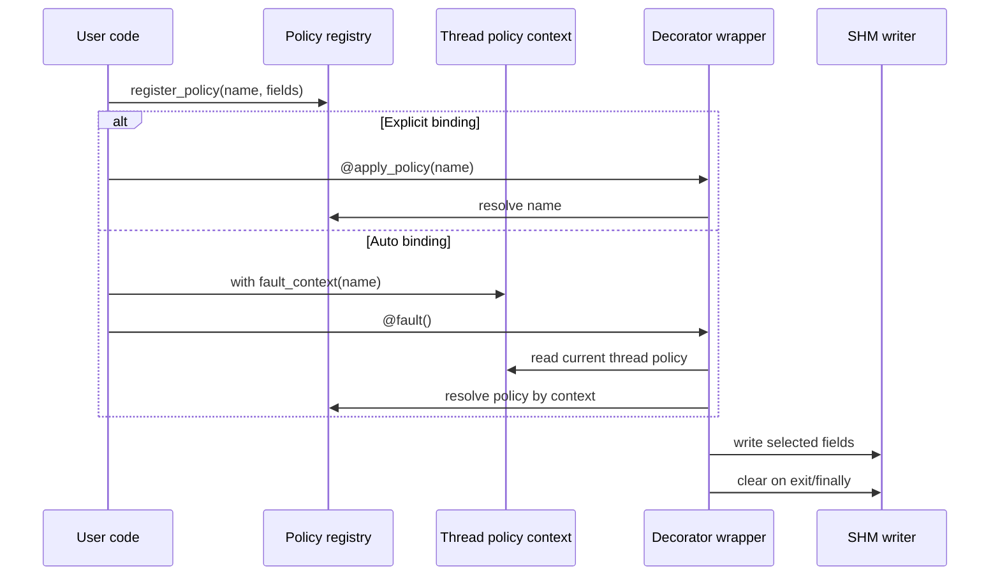
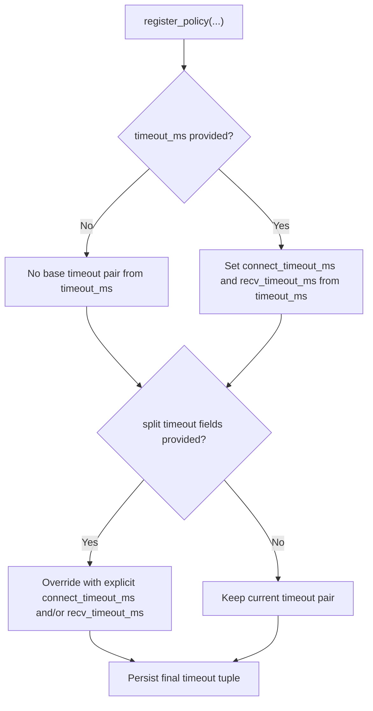

# Policies and Context

This document focuses on policy registration, selection, and scoped application.

## Policy Model

A policy is a named set of optional fields:
- `latency_ms`
- `jitter_ms`
- `packet_loss` (converted to ppm)
- `burst_loss_len`
- `rate` (converted to bps)
- `timeout_ms` or split `connect_timeout_ms` / `recv_timeout_ms`

Policies are stored in a process-local registry protected by a lock.

### Policy Lifecycle Sequence



Diagram focus: registration, selection path, and cleanup behavior.

## Register and Inspect Policies

```python
import faultcore

faultcore.register_policy(
    "slow_link",
    latency_ms=50,
    jitter_ms=10,
    packet_loss="1%",
    burst_loss_len=3,
    rate="2mbps",
    timeout_ms=20,
)

print(faultcore.list_policies())      # ["slow_link"]
print(faultcore.get_policy("slow_link"))
```

Remove a policy:

```python
faultcore.unregister_policy("slow_link")
```

## Apply Policy Explicitly

```python
@faultcore.apply_policy("slow_link")
def op():
    return "ok"
```

If the policy is missing when decoration runs, the wrapper still executes the function with no policy fields applied.

## Auto Policy with Thread Context

`fault()` defaults to `policy_name="auto"` and reads thread-local policy.

```python
import faultcore

faultcore.register_policy("inner", packet_loss="0.1%")

with faultcore.fault_context("inner"):
    @faultcore.fault()
    def op():
        return "ok"
    op()
```

The previous thread policy is restored on context exit.

## Load Policies from File

JSON and YAML are supported:

```python
count = faultcore.load_policies("policies.json")
print(count)
```

File format:

```json
{
  "policy_name": {
    "latency_ms": 7,
    "jitter_ms": 3,
    "packet_loss": "0.2%",
    "burst_loss_len": 2,
    "rate": "1mbps",
    "timeout_ms": 9
  }
}
```

Notes:
- YAML support requires `PyYAML`.
- Root value must be an object keyed by policy name.

## Precedence Notes

- `timeout_ms` sets both connect and recv timeout.
- If split timeout fields are also provided, split fields are used for final stored timeout tuple.
- Missing fields are simply omitted from the policy; decorators only write fields that exist.

### Timeout Precedence Flow



Diagram focus: how shared and split timeout values resolve.

## Related

- API details: `docs/api_reference.md`
- Interceptor behavior and SHM: `docs/interceptor_and_shm.md`
