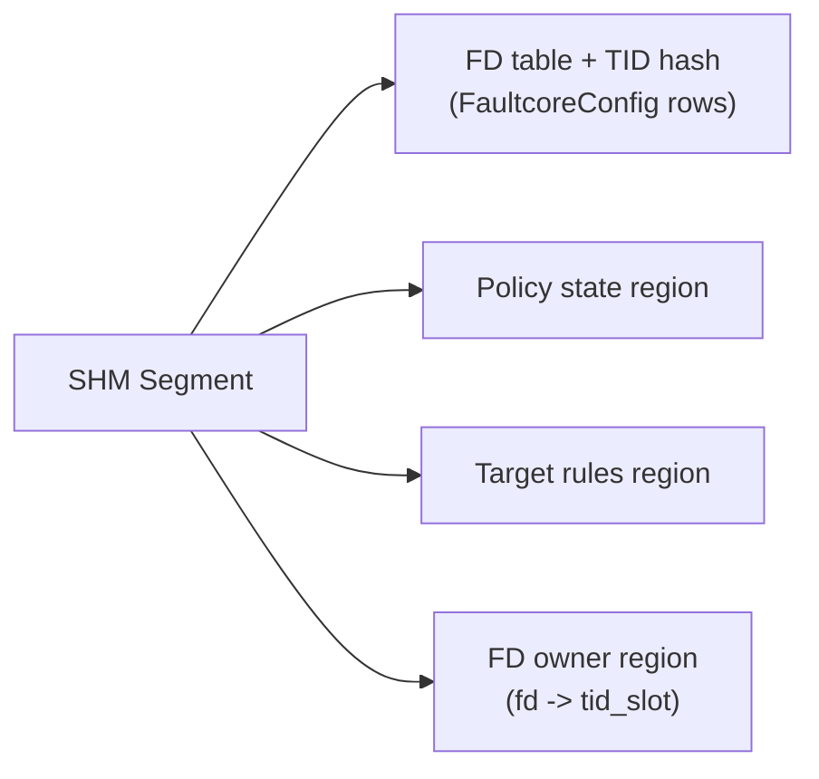
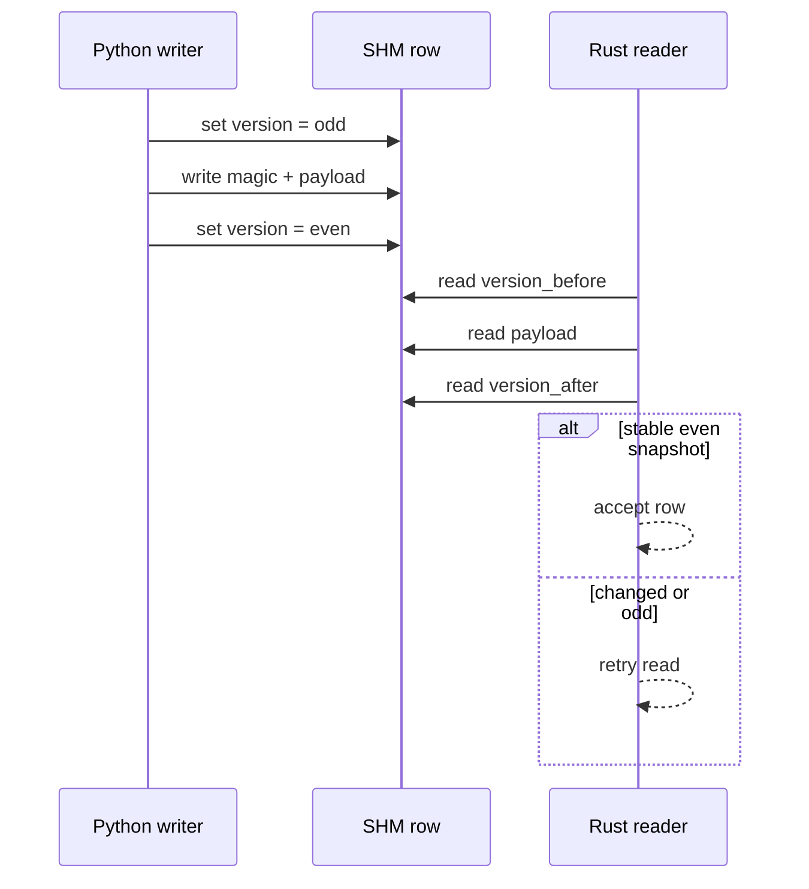
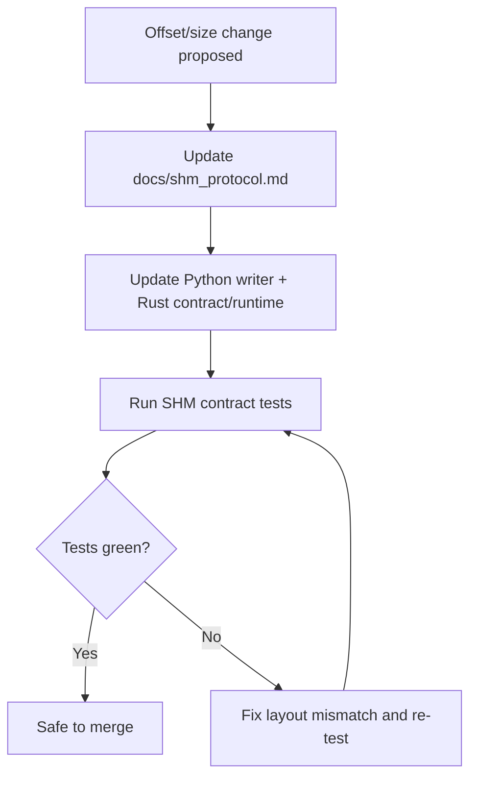

# Faultcore Shared Memory Protocol

This document defines the shared binary contract between:
- `src/faultcore/shm_writer.py` (Python writer)
- `faultcore_network/src/shm_contract.rs` (Rust contract)
- `faultcore_network/src/shm_runtime.rs` (Rust SHM runtime)

## Segment
- Name: `FAULTCORE_CONFIG_SHM` or `"/faultcore_<pid>_config"`
- Type: POSIX SHM (`/dev/shm/...`)
- Size:
  - FD table + TID hash table: `(MAX_FDS + MAX_TIDS) * CONFIG_SIZE`
  - Policy state region: `MAX_POLICIES * sizeof(PolicyState)`
  - Target rules region: `MAX_TIDS * MAX_TARGET_RULES_PER_TID * sizeof(TargetRule)`
  - FD owner region (`fd -> tid_slot`): `MAX_FDS * sizeof(u64)`

### Region Layout Diagram

Diagram focus: top-level SHM memory regions consumed by writer/runtime.

## FaultcoreConfig (376 bytes)
- Endianness: little-endian
- Fixed packed layout

| Field | Offset | Size | Type |
|---|---:|---:|---|
| `magic` | 0 | 4 | `u32` |
| `version` | 4 | 8 | `u64` |
| `latency_ns` | 12 | 8 | `u64` |
| `jitter_ns` | 20 | 8 | `u64` |
| `packet_loss_ppm` | 28 | 8 | `u64` |
| `burst_loss_len` | 36 | 8 | `u64` |
| `bandwidth_bps` | 44 | 8 | `u64` |
| `connect_timeout_ms` | 52 | 8 | `u64` |
| `recv_timeout_ms` | 60 | 8 | `u64` |
| `uplink_latency_ns` | 68 | 8 | `u64` |
| `uplink_jitter_ns` | 76 | 8 | `u64` |
| `uplink_packet_loss_ppm` | 84 | 8 | `u64` |
| `uplink_burst_loss_len` | 92 | 8 | `u64` |
| `uplink_bandwidth_bps` | 100 | 8 | `u64` |
| `downlink_latency_ns` | 108 | 8 | `u64` |
| `downlink_jitter_ns` | 116 | 8 | `u64` |
| `downlink_packet_loss_ppm` | 124 | 8 | `u64` |
| `downlink_burst_loss_len` | 132 | 8 | `u64` |
| `downlink_bandwidth_bps` | 140 | 8 | `u64` |
| `ge_enabled` | 148 | 8 | `u64` |
| `ge_p_good_to_bad_ppm` | 156 | 8 | `u64` |
| `ge_p_bad_to_good_ppm` | 164 | 8 | `u64` |
| `ge_loss_good_ppm` | 172 | 8 | `u64` |
| `ge_loss_bad_ppm` | 180 | 8 | `u64` |
| `conn_err_kind` | 188 | 8 | `u64` |
| `conn_err_prob_ppm` | 196 | 8 | `u64` |
| `half_open_after_bytes` | 204 | 8 | `u64` |
| `half_open_err_kind` | 212 | 8 | `u64` |
| `dup_prob_ppm` | 220 | 8 | `u64` |
| `dup_max_extra` | 228 | 8 | `u64` |
| `reorder_prob_ppm` | 236 | 8 | `u64` |
| `reorder_max_delay_ns` | 244 | 8 | `u64` |
| `reorder_window` | 252 | 8 | `u64` |
| `dns_delay_ns` | 260 | 8 | `u64` |
| `dns_timeout_ms` | 268 | 8 | `u64` |
| `dns_nxdomain_ppm` | 276 | 8 | `u64` |
| `target_enabled` | 284 | 8 | `u64` |
| `target_kind` | 292 | 8 | `u64` |
| `target_ipv4` | 300 | 8 | `u64` |
| `target_prefix_len` | 308 | 8 | `u64` |
| `target_port` | 316 | 8 | `u64` |
| `target_protocol` | 324 | 8 | `u64` |
| `schedule_type` | 332 | 8 | `u64` |
| `schedule_param_a_ns` | 340 | 8 | `u64` |
| `schedule_param_b_ns` | 348 | 8 | `u64` |
| `schedule_param_c_ns` | 356 | 8 | `u64` |
| `schedule_started_monotonic_ns` | 364 | 8 | `u64` |
| `reserved` | 372 | 4 | `u32` |

Constants:
- `FAULTCORE_MAGIC = 0xFACC0DE`
- `CONFIG_SIZE = 376`
- `MAX_FDS = 131072`
- `MAX_TIDS = 65536`
- `MAX_TARGET_RULES_PER_TID = 8`

## Target Rules Region

`TargetRule` is a fixed 64-byte row stored in a per-TID-slot table:

| Field | Type | Notes |
|---|---|---|
| `enabled` | `u64` | `0/1` |
| `priority` | `u64` | Higher wins |
| `kind` | `u64` | `1=host`, `2=cidr` |
| `ipv4` | `u64` | IPv4 address (lower 32 bits) |
| `prefix_len` | `u64` | CIDR prefix (`0..32`) |
| `port` | `u64` | `0` means any |
| `protocol` | `u64` | `0=any`, `1=tcp`, `2=udp` |
| `reserved` | `u64` | reserved |

Selection semantics for `targets[]`:
- consider first `target_enabled` rules;
- choose matching rule with greatest `priority`;
- ties are resolved by first rule in registration order.

## Write/Read Consistency
- Python uses optimistic versioning:
  - marks `version` as odd during write;
  - writes `magic` + payload;
  - publishes `version` as even when done.
- Rust validates stable reads using a double-read of `version` plus fences.

### Consistency Sequence Diagram

Diagram focus: odd/even publish protocol and reader stability check.

## Compatibility Rule
Any change in offsets/size must:
1. update this document,
2. update Python and Rust together,
3. keep SHM contract tests green.

### Compatibility Update Flow

Diagram focus: mandatory synchronization path for SHM schema changes.

## Runtime Model over SHM

The SHM layout is stable, and runtime consumption is consolidated:

- The engine builds `PacketContext` by operation (`Connect`, `Send`, `Recv`, `DnsLookup`).
- The FaultOSI pipeline applies layers in fixed OSI order `L1..L7`.
- All fault decisions flow through a single `LayerDecision` enum.
- The interceptor only maps `LayerDecision` to return values/errno (`syscalls` and `getaddrinfo`).

This reduces duplicated logic between engine/interceptor and keeps behavior verifiable through mapping tests.

For module-level ownership and dataflow, see `docs/architecture.md`.
