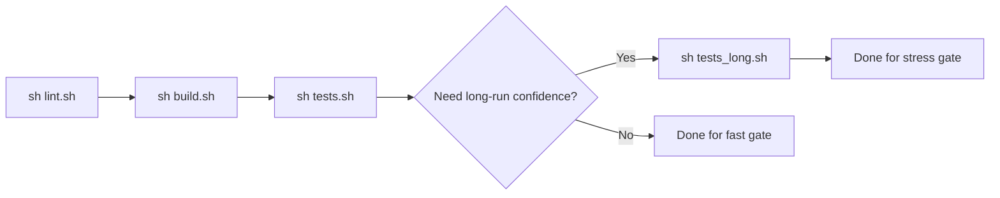

# Testing and Examples

This document describes build/test commands and example execution.
For tuning guidance in longer operational runs, see `docs/operations_tuning.md`.

## Build

```bash
./build.sh
```

This builds the Python extension and Rust interceptor artifacts used by examples/tests.

## Validation Path



Diagram focus: recommended execution order for fast and long validation paths.

## Primary Test Entry Point

Run:

```bash
sh tests.sh
```

`tests.sh` performs:
- Rust tests for `faultcore_interceptor`;
- Rust tests for `faultcore_network`;
- Python unit tests with interceptor preloaded;
- integration CLI scripts in `tests/integration/`.

Includes `record/replay` integration coverage via:

```bash
tests/integration/test_record_replay.py
```

## Long Stress Entry Point

Run:

```bash
sh tests_long.sh
```

`tests_long.sh` is a separate long-run stress path (not part of the regular fast gate in `tests.sh`).
It starts local servers and runs:

```bash
tests/integration/test_stress.py --mode long
```

Tune with environment variables:
- `STRESS_DURATION` (default `20`)
- `STRESS_WORKERS` (default `24`)
- `STRESS_MAX_ERROR_RATE` (default `0.02`)
- `STRESS_MAX_RSS_DELTA_KB` (default `131072`)

Reference run on **2026-03-11**:
- `stress integration: PASS`
- `baseline`: `206676 ops`, `avg_ms=2.36`
- `policy_latency`: `3420 ops`, `avg_ms=140.75`
- `rss_delta_kb=49936`

## Integration CLI Scripts

Current files in `tests/integration/` are CLI-oriented network probes (not pytest fixture-based tests).
They are invoked with explicit args from `tests.sh`, for example:

```bash
.venv/bin/python tests/integration/test_latency.py --host 127.0.0.1 --port 9000 --mode latency --count 3
.venv/bin/python tests/integration/test_timeout.py --host 127.0.0.1 --port 9000 --mode recv --timeout 500
.venv/bin/python tests/integration/test_bandwidth.py --host 127.0.0.1 --port 9000 --mode throughput --messages 20
```

## Running Examples

Use preload helper:

```bash
examples/run_with_preload.sh 01_http_requests.py
```

Some examples expect local servers:
- TCP echo server: `tests/integration/servers/tcp_echo_server.py --host 127.0.0.1 --port 9000`
- UDP echo server: `tests/integration/servers/udp_echo_server.py --host 127.0.0.1 --port 9001`
- HTTP test server: `python -m uvicorn tests.integration.servers.http_server:app --host 127.0.0.1 --port 8000`

## Example Set

- `examples/01_http_requests.py`
- `examples/02_http_async.py`
- `examples/03_tcp_client.py`
- `examples/04_udp_client.py`
- `examples/05_rate_limit.py`
- `examples/06_multi_protocol.py`
- `examples/08_bandwidth_throttle.py`
- `examples/09_network_timeout.py`
- `examples/10_target_priority.py`
- `examples/11_fault_metrics.py`
- `examples/12_perf_baseline.py`
- `examples/13_end_to_end_scenarios.py`

## Notes on Rate Semantics

`rate_limit(rate=...)` configures bandwidth in bps (string units or numeric conversion), not request-per-second quotas.
Example output text may refer to "rate setting" or throughput effects.
