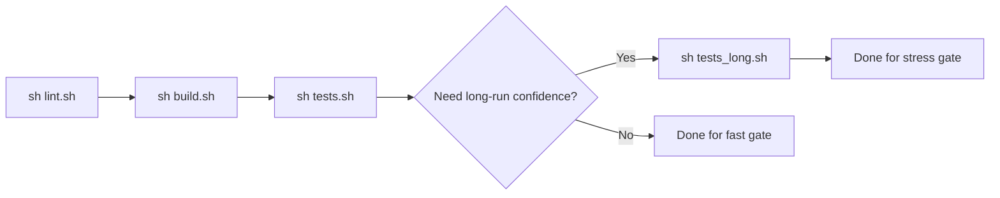

# Testing and Examples

This document covers build and test commands plus example execution.
For tuning guidance in longer operational runs, see `docs/operations_tuning.md`.

## Build

```bash
uv sync --group dev
./build.sh
```

This builds and stages platform-native artifacts in `src/faultcore/_native/<platform-tag>/`
before producing `dist/*.whl`.

`tests.sh` and `tests_long.sh` invoke `.venv/bin/python` directly, so run the sync command in repository root first.
Supported native test platforms are Linux `x86_64` and Linux `aarch64`.

`build.sh` enforces version alignment between:
- `pyproject.toml` (`project.version`)
- `faultcore_interceptor/Cargo.toml`
- `faultcore_network/Cargo.toml`

## Validation Path



Recommended execution order for fast and long validation paths.

## Primary Test Entry Point

Run:

```bash
sh tests.sh
```

`tests.sh` performs:
- Rust tests for `faultcore_interceptor`;
- Rust tests for `faultcore_network`;
- Python unit tests with interceptor preloaded;
- integration CLI scripts in `tests/integration/`.

On Linux, `tests.sh` is strict: if
`src/faultcore/_native/<platform-tag>/libfaultcore_interceptor.so` is missing,
it exits with error and asks to run `sh build.sh`.

Includes `record/replay` integration coverage via:

```bash
tests/integration/test_record_replay.py
```

## Long Stress Entry Point

Run:

```bash
sh tests_long.sh
```

`tests_long.sh` is a separate long-run stress path (not part of the regular fast gate in `tests.sh`).
It starts local servers and runs:

```bash
tests/integration/test_stress.py --mode long
```

`tests_long.sh` requires Linux with a built interceptor artifact and exits on unsupported platforms.

Tune with environment variables:
- `STRESS_DURATION` (default `20`)
- `STRESS_WORKERS` (default `24`)
- `STRESS_MAX_ERROR_RATE` (default `0.02`)
- `STRESS_MAX_RSS_DELTA_KB` (default `131072`)

Capture run-specific baselines in CI artifacts or local logs instead of relying on fixed historical numbers in docs.

## Integration CLI Scripts

Current files in `tests/integration/` are executable CLI-oriented network probes.
`tests.sh` discovers `tests/integration/test_*.py` and executes each script with `--host` and `--port` arguments.
You can also run selected scripts manually with explicit args, for example:

```bash
uv run python tests/integration/test_latency.py --host 127.0.0.1 --port 9000 --mode latency --count 3
uv run python tests/integration/test_timeout.py --host 127.0.0.1 --port 9000 --mode recv --timeout 500
uv run python tests/integration/test_bandwidth.py --host 127.0.0.1 --port 9000 --mode throughput --messages 20
```

## Integration Pytest Profiles

Network integration tests support shared pytest profiles via `tests/conftest.py`:
- `smoke` (default): fast checks
- `full`: wider scenario matrix

Run only network integration tests:

```bash
uv run pytest tests/integration -m integration_network --it-profile smoke
uv run pytest tests/integration -m integration_network --it-profile full
```

Target endpoint can be customized:

```bash
uv run pytest tests/integration -m integration_network --it-profile smoke --it-host 127.0.0.1 --it-port 9000
```

Equivalent env vars:
- `FAULTCORE_IT_PROFILE`
- `FAULTCORE_IT_HOST`
- `FAULTCORE_IT_PORT`

## Running Examples

CLI-first:

```bash
uv run faultcore doctor
uv run faultcore run -- python examples/1_http_requests.py
uv run faultcore run --run-json artifacts/example_run.json -- python examples/6_multi_protocol.py
uv run faultcore report --input artifacts/example_run.json --output artifacts/example_report.html
```

`faultcore run` uses strict probing on Linux by default. Use `--no-strict` only when debugging preload issues.

Some examples expect local servers:
- TCP echo server: `uv run python tests/integration/servers/tcp_echo_server.py --host 127.0.0.1 --port 9000`
- UDP echo server: `uv run python docker/servers/udp_echo_server.py --host 127.0.0.1 --port 9001`
- HTTP test server: `uv run python -m uvicorn tests.integration.servers.http_server:app --host 127.0.0.1 --port 8000`

Advanced/manual path (debugging only):

```bash
examples/run_with_preload.sh 1_http_requests.py
```

## Example Set

- `examples/1_http_requests.py`
- `examples/2_http_async.py`
- `examples/3_tcp_client.py`
- `examples/4_udp_client.py`
- `examples/5_rate_limit.py`
- `examples/6_multi_protocol.py`
- `examples/7_latency_jitter.py`
- `examples/8_bandwidth_throttle.py`
- `examples/9_network_timeout.py`
- `examples/10_target_priority.py`
- `examples/11_fault_metrics.py`
- `examples/12_perf_baseline.py`
- `examples/13_end_to_end_scenarios.py`

## Notes on Rate Semantics

`@faultcore.rate("...")` configures bandwidth in bps units (`bps`, `kbps`, `mbps`, `gbps`), not request-per-second quotas.
Example output text may refer to "rate setting" or throughput effects.

## Lint Modes

`lint.sh` has two modes:
- `sh lint.sh` (or `sh lint.sh check`): verification only, runs `cargo clippy` then `ruff check` + `ruff format --check`.
- `sh lint.sh fix`: keeps `cargo clippy` in deny-warnings mode, then applies Python fixes with `ruff check --fix` + `ruff format`.
